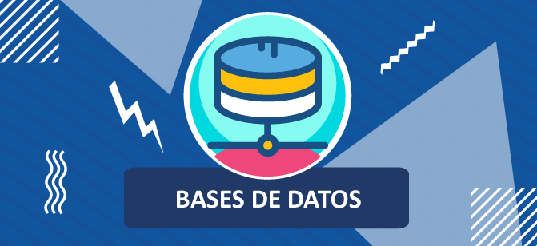
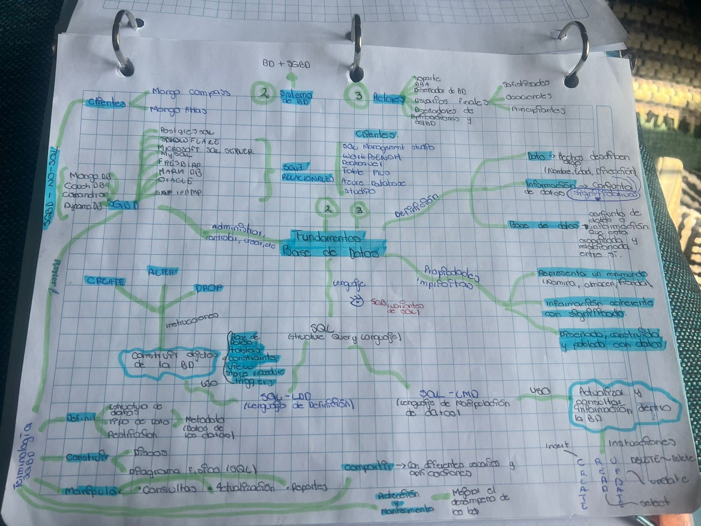

# Base de Datos

>En este repositorio se encuentran temas a relacion a base de datos, diseño en lenguaje SQL, manejo de sistemas Gestores de Base de Datos como MySQL y Microsoft SQL SERVER

Lost¿ temas que se encuentran en el repositorio son:

1. Fundamentos de Base de Datos
2. Modelado de Base de Datos
3. Construccion de Base de Datos
4. Lenguaje Estructurado de Consulta

